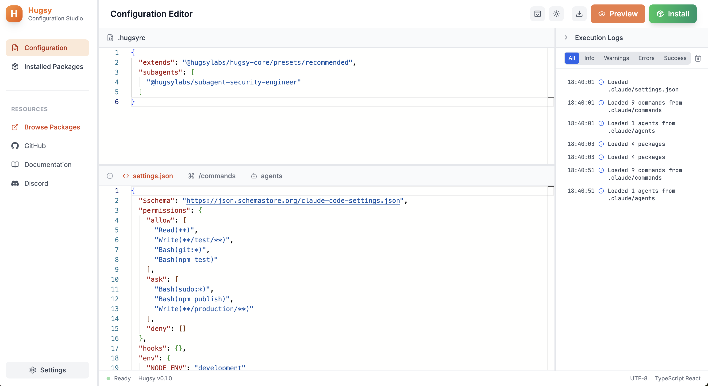

# 🐧 Hugsy

> The ultimate configuration for Claude Code. Transform your AI coding agents into a team-aligned powerhouse.

[](https://github.com/HugsyLab/hugsy/actions/workflows/ci.yml)
[](https://opensource.org/licenses/MIT)
[](https://pnpm.io/)

## What is Hugsy?

Hugsy is a configuration management system for Claude Code that enables teams to:

- 📝 **Define Claude's behavior** through declarative configuration files
- 🎯 **Standardize AI workflows** across your entire organization
- 🔧 **Extend functionality** through a robust plugin system
- 📦 **Share configurations** as reusable presets

It ensures your AI coding agents follow your team's standards, workflows, and best practices.

<p align="center">
  
  <br>
  <em>Hugsy's intuitive web interface for managing configurations</em>
</p>

## Why Hugsy?

### The Problem

Every developer configures Claude Code differently. This leads to:

- Inconsistent AI behaviors across team members
- Repeated setup for common workflows
- Security risks from overly permissive settings
- Lost productivity from manual configuration

### The Solution

Hugsy provides a unified configuration system that:

- Compiles human-readable configs into Claude-compatible settings
- Enables configuration inheritance and composition
- Validates settings before deployment
- Shares best practices through presets

### Without Hugsy vs With Hugsy

|                  | Without Hugsy           | With Hugsy           |
| ---------------- | ----------------------- | -------------------- |
| Config size      | 200+ lines JSON         | 10 lines JSON        |
| Team consistency | ❌ Manual per developer | ✅ Presets + Plugins |
| Security         | ❌ Easy to miss         | ✅ Enforced rules    |
| Slash Commands   | ❌ Scattered files      | ✅ Centralized       |
| Maintenance      | ❌ Update everywhere    | ✅ Update once       |

## Features

### 🎯 Configuration Compiler

Transform simple `.hugsyrc.json` files into comprehensive Claude Code settings:

```json
{
  "extends": "@hugsylabs/hugsy-compiler/presets/development",
  "slashCommands": {
    "presets": ["slash-commands-common"]
  }
}
```

Compiles to a complete `.claude/settings.json` and `.claude/commands/` with all necessary configurations.

### 🔌 Plugin Architecture

Extend and customize Hugsy's behavior:

```javascript
// plugins/security-scanner.js
export default {
  name: 'security-scanner',
  transform(config) {
    // Add security restrictions to protect sensitive files
    const existingDeny = config.permissions?.deny || [];

    return {
      env: config.env,
      permissions: {
        allow: config.permissions?.allow,
        ask: config.permissions?.ask,
        deny: [
          ...existingDeny, // Keep existing deny rules
          'Read(**/.env)', // Block all .env files
          'Read(**/secrets/**)', // Block all secrets directories
          'Read(**/*key*)', // Block files containing 'key'
        ],
      },
      hooks: config.hooks,
      commands: config.commands,
    };
  },
};
```

### 📦 Preset Ecosystem

Choose from built-in presets or create your own:

- **development** - Full-featured development environment
- **strict** - Maximum security and restrictions
- **recommended** - Balanced for most projects
- **showcase** - Demonstrates all capabilities

## Installation

```bash
# Global installation (recommended)
npm install -g @hugsylabs/hugsy

# Or per-project
npm install --save-dev @hugsylabs/hugsy
```

## Quick Start

### 1. Use the Web UI (Recommended)

The easiest way to manage your Hugsy configuration is through the web UI:

```bash
hugsy ui
```

This launches a web interface where you can:

- Initialize your configuration with a visual interface
- Edit your `.hugsyrc.json` file with syntax highlighting
- Preview compiled settings before installing
- Browse and manage slash commands
- View compilation logs in real-time

The UI will automatically open in your browser at `http://localhost:3456`.

### 2. Initialize from CLI

Alternatively, you can initialize directly from the command line:

```bash
hugsy init
```

Choose a preset that matches your project type. The configuration will be automatically installed.

> **Note:** Use `hugsy init --no-install` if you want to review the configuration before installing.

### 3. Install packages (optional)

Add plugins or presets to enhance your configuration:

```bash
# Install a community plugin (example)
hugsy install ./plugins/my-team-plugin.js

# Install from npm (when available)
hugsy install @hugsy/plugin-security

# Install multiple packages
hugsy install ./plugins/lint.js ./presets/team-config.json
```

### 4. Manage your configuration

```bash
# Check current status
hugsy status

# Uninstall specific packages
hugsy uninstall ./plugins/my-team-plugin.js

# Uninstall Hugsy completely
hugsy uninstall
```

Your Claude Code configuration is now ready!

## CLI Reference

### `hugsy ui`

Launch the Hugsy web UI for visual configuration management.

**Options:**

- `-p, --port <port>` - Port to run the UI on (default: 3456)
- `-n, --no-open` - Don't open browser automatically

**Example:**

```bash
# Launch UI with auto-open browser
hugsy ui

# Launch on custom port
hugsy ui --port 8080

# Launch without opening browser
hugsy ui --no-open
```

### `hugsy init [preset]`

Initialize Hugsy configuration in your project.

**Arguments:**

- `preset` - Optional preset to use (recommended, security, permissive, custom)

**Options:**

- `-f, --force` - Overwrite existing configuration
- `--no-install` - Skip automatic installation after initialization

**Example:**

```bash
# Interactive initialization
hugsy init

# Use specific preset
hugsy init recommended

# Initialize without auto-install
hugsy init --no-install
```

### `hugsy install [packages...]`

Install Hugsy configuration or add packages to your configuration.

**Arguments:**

- `packages` - Optional packages to install (plugins or presets)

**Options:**

- `-f, --force` - Overwrite existing configuration
- `-v, --verbose` - Show detailed compilation process
- `--no-backup` - Skip backup of existing settings
- `--plugin` - Treat packages as plugins
- `--preset` - Treat packages as presets

**Example:**

```bash
# Install current configuration
hugsy install

# Install plugins
hugsy install ./plugins/security.js ./plugins/lint.js

# Install preset with explicit type
hugsy install ./presets/strict-config.json --preset
```

### `hugsy uninstall [packages...]`

Remove Hugsy or packages from your project.

**Arguments:**

- `packages` - Optional packages to uninstall (if not provided, uninstalls Hugsy entirely)

**Options:**

- `--keep-config` - Keep .hugsyrc.json file (for full uninstall)
- `-y, --yes` - Skip confirmation

**Example:**

```bash
# Uninstall specific packages
hugsy uninstall ./plugins/security.js

# Uninstall Hugsy completely
hugsy uninstall

# Uninstall without confirmation
hugsy uninstall --yes
```

### `hugsy status`

Check the current Hugsy installation status.

**Example:**

```bash
hugsy status
```

### `hugsy config`

Display the current Hugsy configuration.

**Options:**

- `-r, --raw` - Show raw configuration before compilation

**Example:**

```bash
# Show compiled configuration
hugsy config

# Show raw .hugsyrc.json content
hugsy config --raw
```

## Plugin Development

Hugsy plugins are ESM-only modules that transform configurations.

### Basic Plugin Structure

```javascript
// my-plugin.js
export default {
  name: 'my-plugin', // Required: unique identifier
  version: '1.0.0', // Optional: plugin version

  transform(config) {
    // Required: transform function
    return {
      ...config,
      env: {
        ...config.env,
        MY_VAR: 'value',
      },
    };
  },
};
```

**Note:** Add `"type": "module"` to your `package.json`. CommonJS (`module.exports`) is not supported.

### Plugin API

| Property    | Type       | Required | Description                    |
| ----------- | ---------- | -------- | ------------------------------ |
| `name`      | `string`   | ✅       | Unique plugin identifier       |
| `transform` | `function` | ✅       | Config transformation function |
| `version`   | `string`   | ❌       | Plugin version                 |
| `author`    | `string`   | ❌       | Plugin author                  |

### Best Practices

1. **Always return the complete config object**
2. **Preserve existing values using spread operators**
3. **Handle missing fields defensively**

Example:

```javascript
export default {
  name: 'security-plugin',
  transform(config) {
    // Defensive: handle missing permissions
    const currentDeny = config.permissions?.deny || [];

    return {
      ...config, // Preserve all config
      permissions: {
        ...config.permissions,
        deny: [...currentDeny, 'Write(**/.env*)'],
      },
    };
  },
};
```

## Contributing

We welcome contributions! See [CONTRIBUTING.md](CONTRIBUTING.md) for guidelines.

## License

MIT

---

Made with ❤️ by the HugsyLabs🐧 Team
